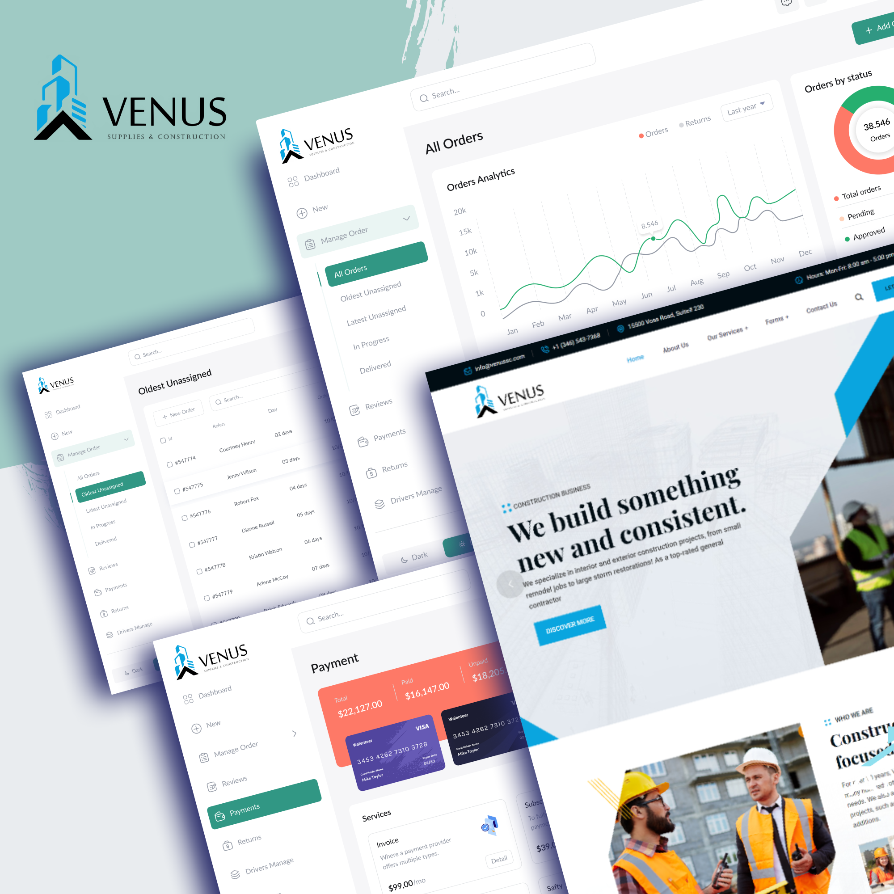
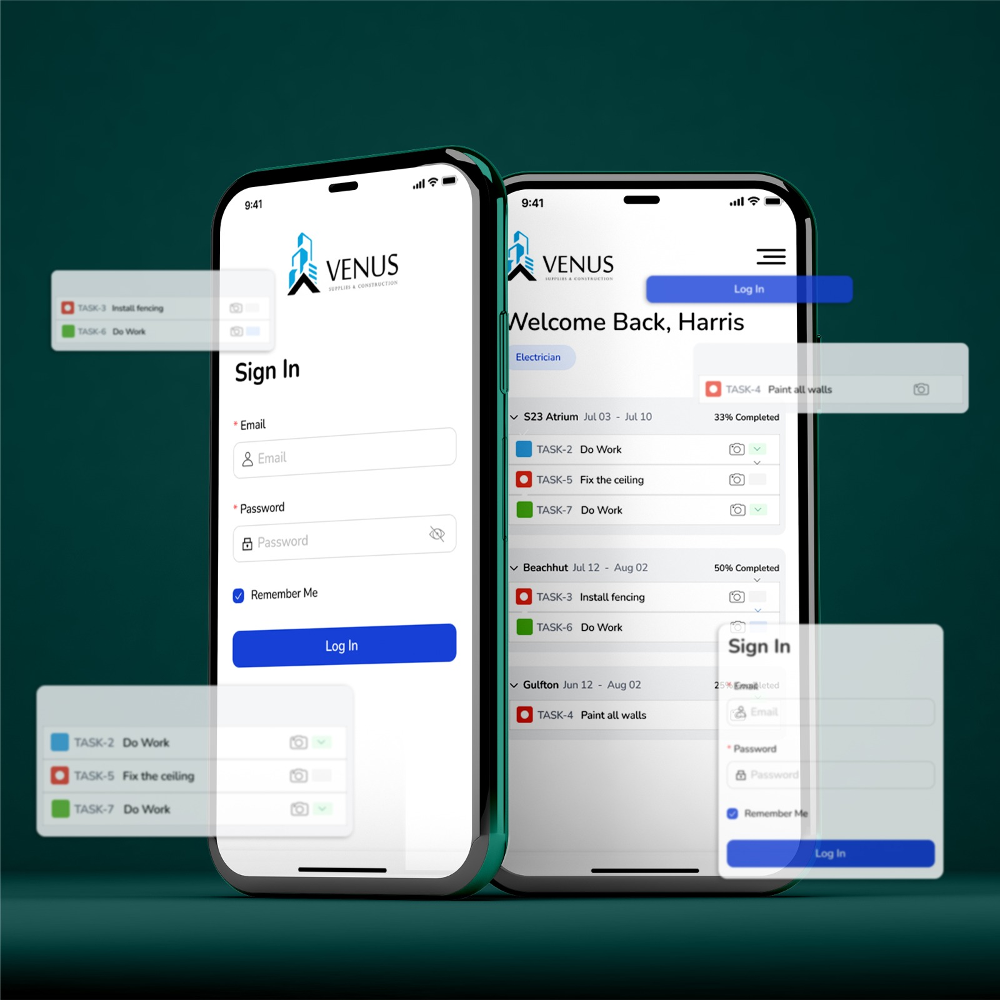
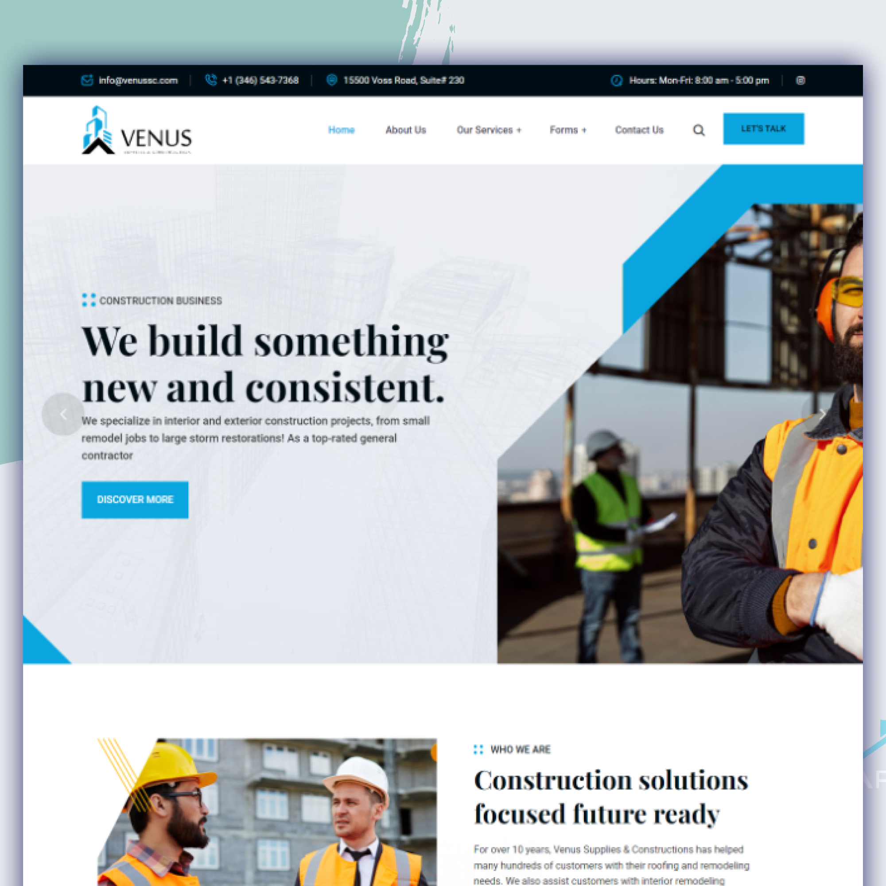
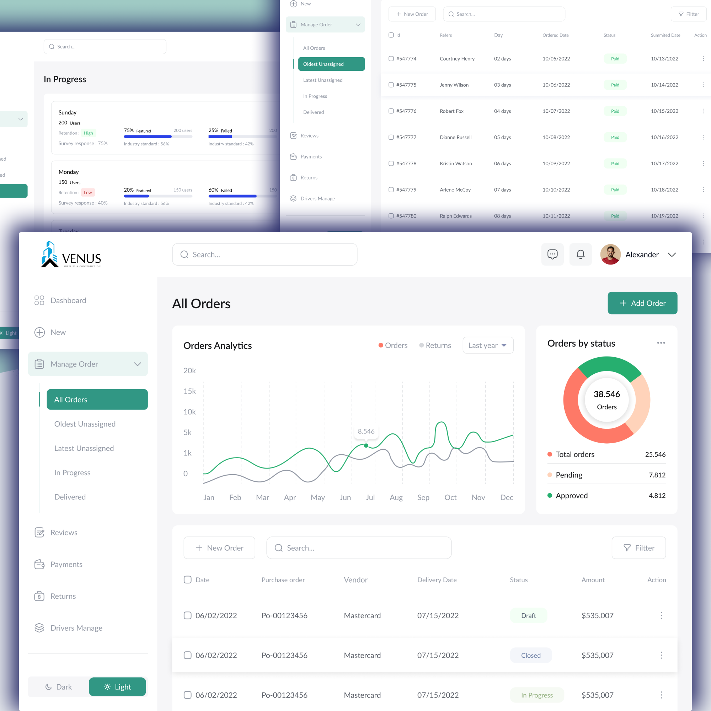
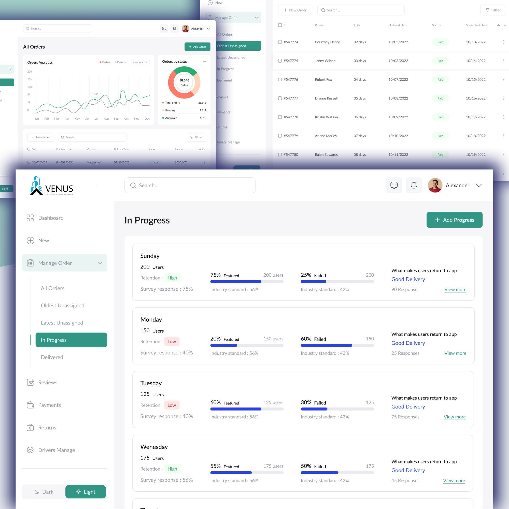
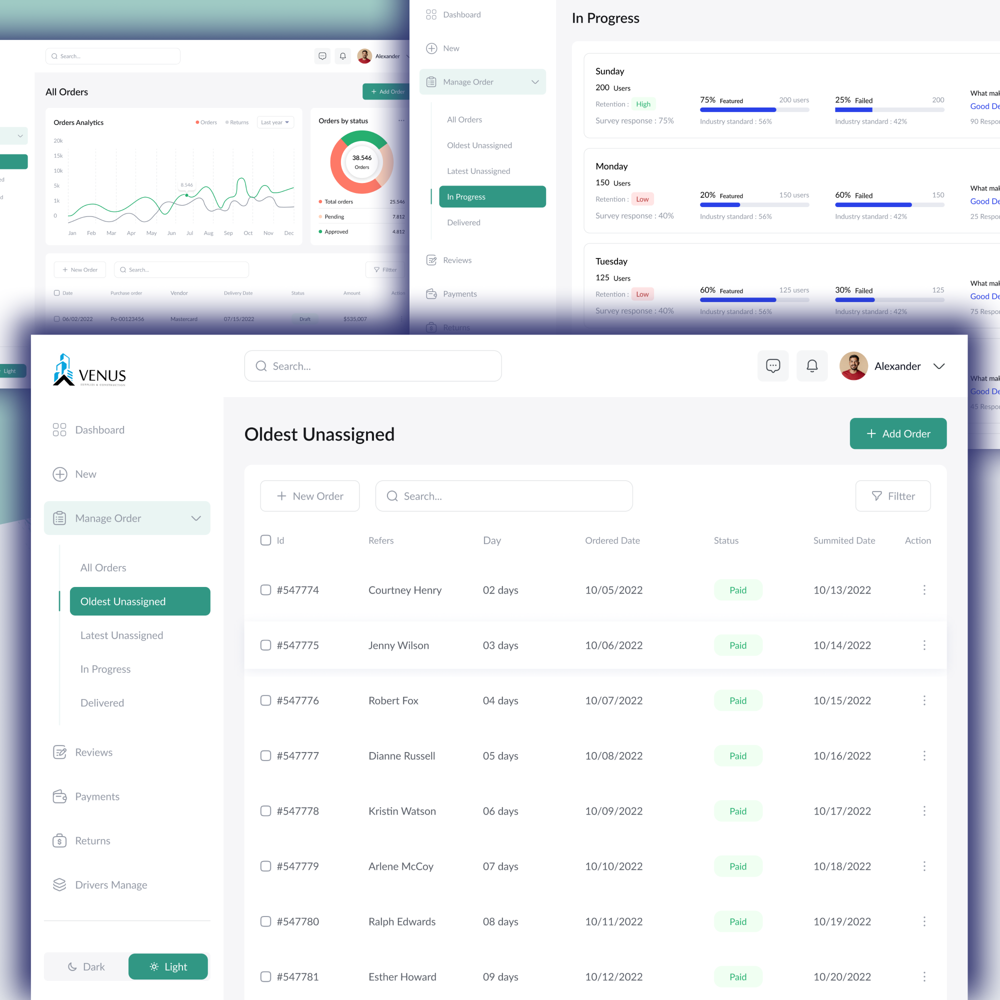

# Venus CRM

For this project, I developed a comprehensive digital solution for Venus Supplies & Constructions, focusing on three key areas:

- **Landing Page:** A user-friendly and visually appealing landing page showcases the company's services, including roofing, flooring, remodeling, painting, plumbing, and siding & gutters. The site highlights completed projects, client testimonials, and detailed information about the company.

- **Internal Dashboard:** A robust dashboard for internal workers and the sales team enables efficient project management. This tool includes features for tracking project progress, managing client interactions, and overseeing team tasks, ensuring streamlined operations and enhanced productivity.

- **Mobile App for Vendors:** A mobile application designed specifically for vendors allows for real-time updates on project statuses. This app facilitates seamless communication between the company and its vendors, ensuring timely updates and accurate project tracking.

These integrated digital solutions have significantly improved operational efficiency, enhanced client satisfaction, and bolstered Venus Supplies & Constructions' overall service delivery.

Note: Code not shared due to agreement with client.

